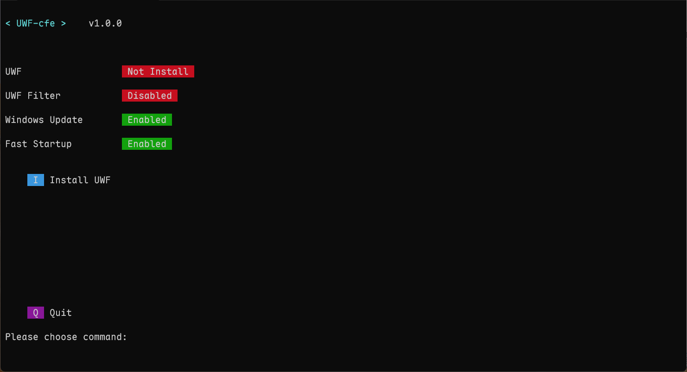

# UWF-cfe

A Windows Unified Write Filter frontend that uses Windows command line.

Need Windows 11 enterptice edition to use.

## Reference

<https://learn.microsoft.com/en-us/windows/configuration/unified-write-filter/>

## Icon

Icons created by Triangle Squad - [Flaticon](https://www.flaticon.com/free-icons/saved)

## Screenshot

