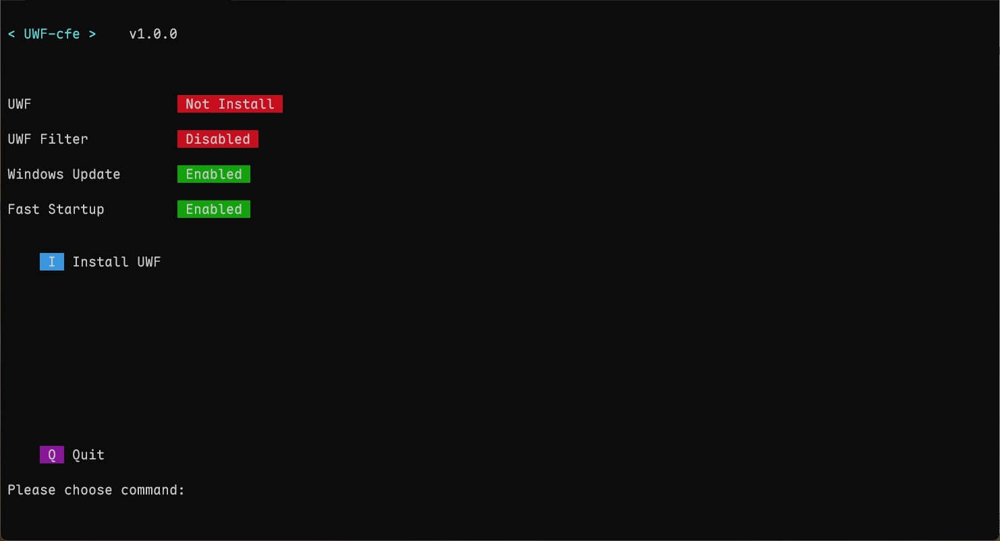

# UWF-cfe

**[繁體中文](#繁體中文)** | **[English](#english)**

## 繁體中文

一個使用 Windows 命令列的 UWF 前端工具，可以提供磁碟還原保護功能，必須要使用 Windows 11 企業版或者教育版。

## 參考資料

[統一寫入過濾器 (UWF) (英文)](https://learn.microsoft.com/en-us/windows/configuration/unified-write-filter/)

## 圖示

由 Triangle Squad 提供 ([Flaticon](https://www.flaticon.com/free-icons/saved))

## 程式截圖

---

## English

A UWF front-end tool for Windows command-line that provides disk protection. Windows 11 Enterprise or Education edition is required.

## Reference

[Unified Write Filter (UWF) feature](https://learn.microsoft.com/en-us/windows/configuration/unified-write-filter/)

## Icon

Icons created by Triangle Squad ([Flaticon](https://www.flaticon.com/free-icons/saved))

## Screenshot

